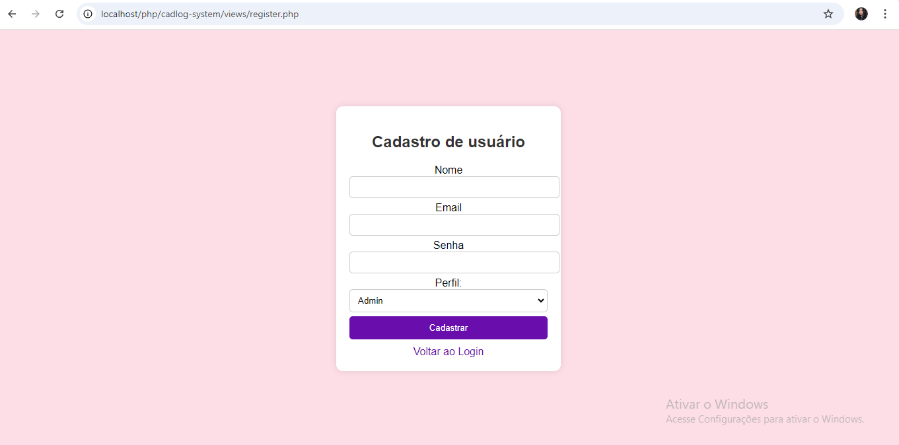
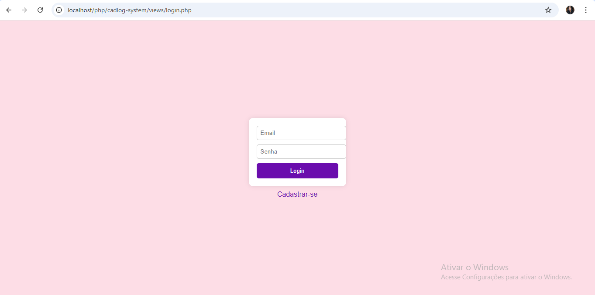

# cadlog-system

## Índice

[Descrição](https://github.com/vickieww/cadlog-system?tab=readme-ov-file#descri%C3%A7%C3%A3o)

[Métodos PHP](https://github.com/vickieww/cadlog-system?tab=readme-ov-file#descri%C3%A7%C3%A3o)

[Funções](https://github.com/vickieww/cadlog-system?tab=readme-ov-file#descri%C3%A7%C3%A3o)

[Tecnologias utilizadas](https://github.com/vickieww/cadlog-system?tab=readme-ov-file#descri%C3%A7%C3%A3o)

[Lições e aprendizados](https://github.com/vickieww/cadlog-system?tab=readme-ov-file#descri%C3%A7%C3%A3o)

[Autores](https://github.com/vickieww/cadlog-system?tab=readme-ov-file#descri%C3%A7%C3%A3o)

## Projeto

## Descrição

Esse projeto cria um sistema de acesso a um site interno, com páginas de cadastro e login. No processo ele faz a autenticação do usuário através de um sistema reforçado que conecta o banco de dados ao front-end, passando por outras páginas de autenticação.

## Métodos PHP

- ``require_once 'models/user.php';:``

Inclui o arquivo user.php apenas uma vez. Caso o arquivo já tenha sido incluído anteriormente, ele não será carregado novamente. Isso evita erros de múltiplas inclusões e melhora a organização do código.

- ``$_SERVER['REQUEST_METHOD'] == 'POST':``

Verifica se a requisição HTTP recebida é do tipo POST, o que indica que um formulário foi enviado. É uma forma de garantir que o código de tratamento do formulário seja executado apenas quando o formulário for submetido.

- ``password_hash($_POST['senha'], PASSWORD_DEFAULT);:``

  O método password_hash encripta a senha para uma linguagem de criptografia padrão(PASSWORD_DEFAULT).

- ``User::create($data);:``

Chama o método create da classe User para inserir os dados do usuário no banco de dados. O array $data contém as informações do formulário, como nome, email, senha, e perfil.

- ``header('Location: index.php');:``

Redireciona o usuário para a página index.php após a execução do cadastro ou login. 

- ``self::$instance = new PDO("mysql:host=$host;dbname=$db", $user, $password);:``

Cria uma nova conexão com o banco de dados utilizando o driver PDO. Aqui, são passadas as credenciais e o nome do banco de dados, e o objeto de conexão é armazenado na variável $instance para garantir que uma única conexão seja utilizada.

- ``self::$instance->setAttribute(PDO::ATTR_ERRMODE, PDO::ERRMODE_EXCEPTION);:``

Configura o modo de erro para exceções. Isso faz com que erros no banco de dados sejam lançados como exceções, facilitando a identificação e tratamento de erros no código.

- ``User::findByEmail($email);:``

Busca um usuário no banco de dados com base no email fornecido.

- ``$_GET['action'] ?? 'login';:``

Função: Verifica se há uma ação definida na URL (através de GET). Se não houver, define a ação indicada por padrão.

- ``$authController->login();:``

Função: Chama o método login da classe AuthController, responsável por lidar com o processo de autenticação do usuário. Neste caso, é chamado quando a ação na URL é login.

## Funções

- ``Cadastro de usuários com diferentes acessos``

  A página de cadastro do sistema interno possui 3 possibilidades de usuários: Colaborador, Gerente e Admin, com diferentes níveis de liberdade para realizar modificações e outros processos no sistema.

- ``Login``

  Ao realizar seu cadastro o sistema dá baixa nos dados informados dentro do banco de dados, tornando possível o acesso do usuário pela página de login, após o mesmo inserir seus dados novamente.
  
## Tecnologias utilizadas

``CSS 3`` ``HTML 5`` ``VSCODE``
``PHP`` ``XAMPP``

## Autores

Vitória Gabrieli  
[Acesse o GitHub](https://github.com/vickieww)  

Orientador Leonardo Rocha  
[Acesse o GitHub](https://github.com/LeonardoRochaMarista)
